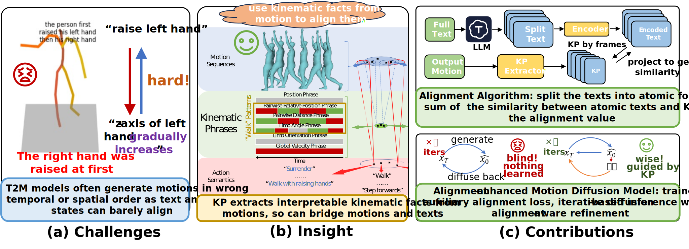

## KETA: Kinematic-Phrases-Enhanced Text-to-Motion Generation via Fine-grained Alignment

> Submitted to ICCVML 2025.

Authors: [Yu Jiang](https://github.com/jpppppppppppppppppppppppp)\*, [Yixing Chen](https://github.com/PolarisDane)\*, [Xingyang Li](https://github.com/Radioheading)\*

- [Source Code](https://github.com/PolarisDane/KETA)

- [Paper](CV_assignment.pdf)

### Abstract

Motion synthesis plays a vital role in various fields of artificial intelligence. Among the various conditions of motion 
generation, text can describe motion details elaborately and is easy to acquire, making text-to-motion(T2M) generation an 
important task. State-of-the-art T2M techniques mainly leverage diffusion models to generate models with text prompts as 
guidance, tackling the many-to-many nature of T2M tasks. However, existing T2M approaches face challenges, given the 
gap between the natural language domain and the physical domain. This gap makes it difficult to generate motions fully 
consistent with the texts. To solve this, we leverage kinematic phrases (KP), an intermediate representation that depicts 
the fine-grained details of motions, as a bridge between these two modalities. Our proposed method, KETA, decomposes 
the given text into several decomposed texts via a large language model. It trains an aligner to align decomposed texts with 
the KP segments extracted from the generated motions. Thus, it’s possible to restrict the behaviors for diffusion-based 
T2M models. During the training stage, we deploy the text-KP alignment loss as an auxiliary goal to supervise the models. 
During the inference stage, we refine our generated motions for multiple rounds. In a new round, we compute the text-KP 
distance as the guidance signal so the motion can finally become consistent with physical settings and text prompts. 
Experiments demonstrate that KETA achieves 1.19x, 1.99x better R precision and FID value than our base motion diffusion 
model. Compared to a wide range of T2M generation models. KETA achieves either the best or the second-best 
performance. 

### Architecture

### Results

### Credit

SJTU Course AI3604: Computer Vision (2024 Fall) Team C Project.

We sincerely thank Xinpeng Liu, Qiaojun Yu, and Yonglu Li for providing insightful guidance on exploring the topic of 
T2M generation. We thank Yichao Zhong, Tianlang Zhao, Tongcheng Zhang, and Jinbo Hu for their valuable feedback 
on different stages of the work. 

MDM Model: [EricGuo5513 / HumanML3D](https://github.com/GuyTevet/motion-diffusion-model)

HumanML3D: [GuyTevet / motion-diffusion-model](https://github.com/EricGuo5513/HumanML3D)